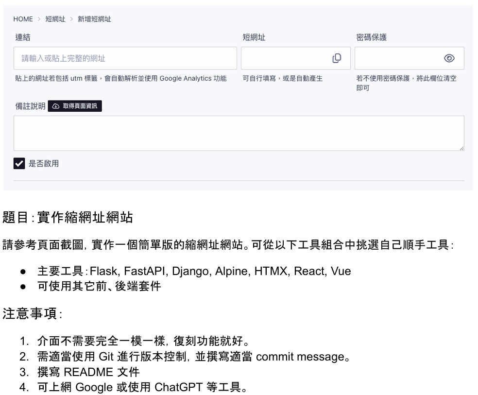

# 專案介紹

此專案為短網址平臺[https://linkcut.cc](https://linkcut.cc)，提供使用者設定自己的賬號，並在賬號下生成/管理對應連結的短網址。   
*首次連線可能會遇到開啟時間緩慢或跳轉只Render的Start界面，請耐心等待
## 目錄
- [功能](#功能)
- [使用](#使用)
- [本機運行](#本機運行)
- [使用技術](#使用技術)
- [其他](#其他)

## 功能

- 自定義短網址代碼
- 設定短網址跳轉密碼
- 自動取得網站簡介
- 快速複製短網址
- 啟用/停用短網址

## 使用

- 打開[https://linkcut.cc](https://linkcut.cc)，點擊「註冊」，創建使用者賬號
- 新增
    - 點擊「新增短網址」
    - 填入要轉換的網址連結，如需自定義短網址代碼/密碼，請一並填寫
    - 點擊「取得頁面資訊」按鈕自動獲取相關資訊，或手動填寫，如不需要空白即可
    - 確認是否需要啟用，如不需要請取消勾選
- 編輯
    - 點選已經建立的短網址，點擊「編輯」
    - 修改要調整的部分
- 刪除
    - 點選已經建立的短網址，點擊「編輯」
    - 點擊「刪除」
- 快速啟用/停用
    - 在列表頁面可以點擊前方的勾選框，快速啟用/停用短網址功能

## 本機運行

python：3.11

uv：0.7.14 ↑

Django：5.2.3

將專案拉回本機
```bash
git clone https://github.com/Andywang-95/short_url.git
```

同步虛擬環境
```bash
uv sync
```

設定`.env`環境變數

執行資料庫遷移
```bash
make migrate` or `uv run manage.py migrate
```

啟動伺服器
```bash
make run` or `uv run manage.py runserver
```

## 使用技術
- 前端：HTML,CSS,JavaScript,TailwindCSS,Alpine.js,HTMX
- 後端：Python,Django
- 資料庫：PostgreSQL
- 部署：Render

## 其他
此專案為五倍學院面試題，題目要求如下：
---

